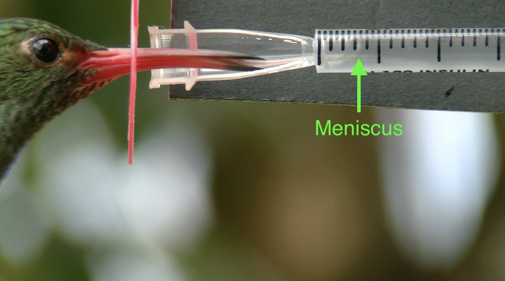
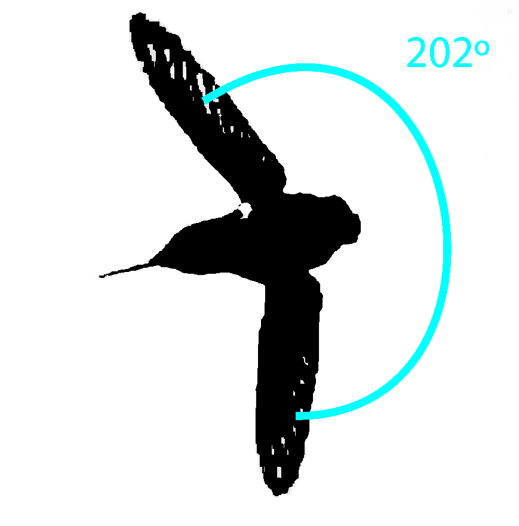

# hummingbird_tracking
Code for tracking things in hummingbird videos. Slides summarizing this work [here](https://docs.google.com/presentation/d/15iygjXGLu7Ha096GwMV5t6sjP7IPcTHqimPkTDwrpPI/present?slide=id.p).

## requirements
- python3
- python packages (easiest installed with pip install <package_name> --user)
    - matplotlib
    - numpy
    - scikit-learn
    - imageio
    - opencv-contrib-python
    - argparse
    - tqdm
- alternatively, one can install via pip (`pip3 install -r requirements.txt`)
  
## usage
- code / documentation for functions is located within subfolders
- "wing_tracking" folder finds angle over time from top view videos
  - 
- "meniscus_tracking" folder find meniscus over time from side view videos
  - 
- to run any code, first open terminal and cd do the directory containing the file
- in general, files/folders with spaces are not encouraged

